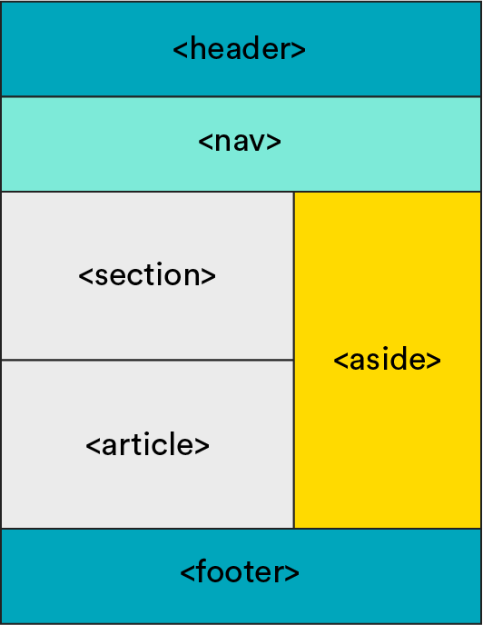

<textarea id="source">

<h1 class="slide-header">Formatting and Organizing Content with HTML</h1>

<span id=time-estimate class="color-grey-500">30 mins</span>

<p id="lesson-description">
While HTML primarily structures the content of a webpage, it also includes useful tags for formatting and organizing text. In this lesson, we’ll explore some of the most common formatting tags and how to use them effectively.
</p>

<h5 id="topics-header" class="color-grey-500">Topics</h5>

Formatting Text with HTML Tags

<hr>

Semantic vs. Non-Semantic HTML

<hr>

Using Tags to Organize Content

<hr>

<a href="./assets/formatting_and_organizing_with_html_study_guide.pdf" target="_blank" download="formatting_and_organizing_with_html_study_guide.pdf" class="ant-btn" data-trackable="true" data-track-category="study guide" data-track-section="lesson page" data-track-action="download study guide"><span role="img" class="anticon"><svg viewBox="0 0 16 16" width="1em" height="1em" fill="currentColor" aria-hidden="true" focusable="false" class=""><g class="download_svg__nc-icon-wrapper"><path d="M8 12c.3 0 .5-.1.7-.3L14.4 6 13 4.6l-4 4V0H7v8.6l-4-4L1.6 6l5.7 5.7c.2.2.4.3.7.3z"></path><path data-color="color-2" d="M1 14h14v2H1z"></path></g></svg></span><span> Download Study Guide</span></a>

---

<h1 class="slide-header">Learning Objectives</h1>

<p>By the end of this lesson, you'll be able to:</p>

<ul>
  <li>Format text using HTML tags.</li>
  <li>Explain the difference between semantic and non-semantic HTML.</li>
  <li>Group HTML elements with a <code>div</code></li>
</ul>

---

<h1 class="slide-header">Options for Styling Text</h1>

While HTML is primarily for structuring content, it also includes some basic elements for formatting text. You’ll explore more advanced styling with CSS in a future lesson, but for now, let’s look at a few built-in HTML tags that modify text appearance.

<br>

| Text Style    | HTML Element Tags     |
| ------------- | --------------------- |
| **bold text** | `<strong>  </strong>` |
| _italic text_ | `<em> </em>`          |

<br>

These tags wrap around the text you want to style:

```html
<p>Try our <strong>Signature Espresso</strong> for a bold flavor.</p>
```

This will display as:

Try our **Signature Espresso** for a bold flavor.

```html
<p>Our <em>organic matcha</em> is a customer favorite!</p>
```

This will display as:

Our _organic matcha_ is a customer favorite!

---

<h1 class="slide-header">Formatting Text</h1>

Let’s add some formatting to Café Aurora’s website!

1. Use `<strong>` to bold "Signature" in `Signature Arabic Coffee`.

2. Use `<em>` to italicize "Organic" in the menu item `Organic Matcha Latte`.

<iframe height="400" style="width: 100%;" scrolling="no" title="Formatting Text with HTML" src="https://codepen.io/GAmarketing/embed/pvoPgvv?default-tab=html%2Cresult&editable=true" frameborder="no" loading="lazy" allowtransparency="true" allowfullscreen="true">
  See the Pen <a href="https://codepen.io/GAmarketing/pen/pvoPgvv">
  Styling Text with HTML</a> by General Assembly (<a href="https://codepen.io/GAmarketing">@GAmarketing</a>)
  on <a href="https://codepen.io">CodePen</a>.
</iframe>

<small><strong>TIP:</strong> After updating your code, click the <strong>"Run"</strong> or <strong>"Rerun"</strong> button in CodePen to make sure your changes take effect. Then, check <strong>View Test Results</strong> to see if your updates pass!</small>

---

<h1 class="slide-header">Adventures in HTML Formatting</h1>

What happens if you add a `<strong>` tag to the `<h1>` text "Café Aurora"?

Not much changes! That’s because all heading tags (`<h1>` - `<h6>`) have built-in bold styling by default. Adding `<strong>` won’t make them “extra bold.”

However, if you add an `<em>` tag, the text will appear italicized!

This shows that some styling tags work on certain elements but may not have a visible effect on others. If a tag doesn’t seem to work, don’t worry—when you learn CSS, you’ll have much more control over styling.

---

<h1 class="slide-header">Organizing Content on a Webpage</h1>

Now that you've formatted text, it's time to organize your content using **HTML structural elements**.

HTML provides tags specifically designed to help define sections of a webpage. While these tags do not change how content appears, they’ll wrap around several elements to say, “These are all related to each other!” Using organizational tags helps browsers, search engines, and developers understand the role of each section.

HTML structural elements fall into two categories: **semantic** and **non-semantic**.

The word "semantic" means that the tag's name is significant and provides meaning about its purpose.

Here's how `semantic HTML` compares to `non-semantic HTML`:

<br>

| Semantic HTML Tags                                                   | Non-Semantic HTML Tags                                  |
| -------------------------------------------------------------------- | ------------------------------------------------------- |
| Tell you something about the content they contain.                   | Don’t tell you much about the content they contain.     |
| Indicate how the content will be displayed on the webpage.           | Are used more generally to organize groups of elements. |
| `<header>`, `<main>`, `<footer>`,<br>`<article>`, `<aside>`, `<nav>` | `<div>`, `<span>`                                       |

<br>

Using semantic HTML tags makes your code more readable and meaningful. For example, a `<header>` tag tells us that a section is at the "head" or top of a page or a content block, while a `<footer>` typically holds contact details or copyright information near the bottom or "foot" of the page.

---

<h1 class="slide-header">Semantic HTML</h1>

Semantic HTML helps introduce both **meaning** and **organization** to a webpage. Most webpages include common sections, such as a _navigation bar_, a _main content area_, and a _footer_.

As a developer, structuring your content with semantic HTML makes it easier to understand and maintain. It helps browsers and search engines understand what different parts of a webpage mean.

When a browser sees a `<nav>` tag on a website, it knows, _"Hey! This is the navigation. It will help people get around the site and tells me what content is here."_

Here’s an example of how some common semantic tags are used in a webpage layout:




<small><a href="https://www.w3schools.com/html/html5_semantic_elements.asp" target="_blank" rel="noreferrer noopener">Visit w3schools for a complete list of semantic elements.</a></small>

---

<h1 class="slide-header">Knowledge Check</h1>

Let’s look at Café Aurora's website. Which semantic tag might we add around `<h1>` and `<h2>` to group them together?

```html
<h1>Café Aurora</h1>
<h2>Bringing people together over artisanal coffee and fresh pastries.</h2>
<p>Locally roasted coffee, specialty teas, and homemade treats.</p>
<p>
  <a
    href="https://www.example.com/menu"
    target="_blank"
    >View our menu.</a
  >
</p>
<p>
  <a
    href="https://www.example.com/reviews"
    target="_blank"
    >See what our customers are saying.</a
  >
</p>

<h2>Our Specialties</h2>
<ul>
  <li>Handcrafted Espresso</li>
  <li><strong>Signature</strong> Arabic Coffee</li>
  <li><em>Organic</em> Matcha Latte</li>
  <li>Freshly Baked Croissants</li>
  <li>Traditional Date Pastries</li>
</ul>


```

<fieldset>
  <legend>Please select one of the following</legend>
  <input type="radio" name="action" id="main-answer" value="main"  /><label for="main-answer">main</label><br />
  <input type="radio" name="action" id="nav-answer" value="nav" /><label for="nav-answer">nav</label><br />
  <input type="radio" name="action" id="header-answer" value="header" correct="true"/><label for="header-answer">header</label><br />
  <input type="radio" name="action" id="article-answer" value="article"  /><label for="article-answer">article</label><br />
</fieldset>
<button class="ant-btn ant-btn-primary multiple-choice-radio-submit">Submit Answer</button>

---

<h1 class="slide-header">Non-Semantic HTML</h1>

Sometimes, you just need to group elements together without assigning a specific meaning to them. In these cases, you can use non-semantic HTML tags:

- `<div>`: A container used to group multiple elements together.

- `<span>`: An inline container used to style or manipulate a small portion of text.

Non-semantic tags don’t describe the content they contain, but they are essential for organizing content, especially when applying styles with CSS.

---

<h1 class="slide-header">Non-Semantic Tags</h1>

**The `div` Tag**

`<div>` stands for division, as in the division of content. Think of `<div>` as a way to group related elements on your webpage into logical sections. This helps with organization and makes it easier to apply styles later.

For example, let’s say we want to group related content together:

```html
<div>
  <h2>The start of a very important section.</h2>
  <p>This section has content that’s all related in some way.</p>
  <p>So we want to group it together and set it off from the rest of the page.</p>
  <p>That’s why we wrapped all of this in a div!</p>
</div>
```

Here, all the related content is wrapped inside a `<div>`, allowing us to treat it as a single section.

---

<h1 class="slide-header">Non-Semantic Tags</h1>

**The `span` Tag**

You can also group content on a smaller level—within a sentence or paragraph—using the `<span>` tag. Maybe you want to emphasize a few words or apply a different style to a specific part of a sentence. `<span>` allows you to do that!

The syntax of `<span>` is similar to `<strong>` and `<em>` but doesn’t actually change how text looks. Instead, it is used for styling or scripting purposes.

For example:

```html
<p>I want to call out <span>these words</span> in this sentence, but none of the other ones.</p>
```

This allows developers to style only the text inside the `<span>`, such as changing the color, font size, or adding special effects with CSS.

While `<div>` and `<span>` don’t add meaning like semantic tags, they are essential tools for grouping and styling content effectively!

---

<h1 class="slide-header">The <code>div</code> Challenge</h1>

Your challenge: In a new `<div>` container, add a header and list of café team members to the webpage.

Follow these steps:

**1. Beneath the `` tag, open a new `<div>`.**

**2. In the `<div>`, add an `<h2>` with text that reads: `Meet Our Team`.**

**3. After the `<h2>`, add an _unordered list_ element opening tag.**

**4. Add the following team members as list items and close the `<ul>`:**

- `Omar Khalid: Head Barista`
- `Aiden Lee: Pastry Chef`
- `Sofia Chen: Café Manager`
- `Mateo Alvarez: Customer Relations`

**5. Close the `<div>`.**

Happy organizing!

<iframe height="400" style="width: 100%;" scrolling="no" title="The Div Challenge" src="https://codepen.io/GAmarketing/embed/RNwVrWB?default-tab=html%2Cresult&editable=true" frameborder="no" loading="lazy" allowtransparency="true" allowfullscreen="true">
  See the Pen <a href="https://codepen.io/GAmarketing/pen/RNwVrWB">
  The Div Challenge</a> by General Assembly (<a href="https://codepen.io/GAmarketing">@GAmarketing</a>)
  on <a href="https://codepen.io">CodePen</a>.
</iframe>

<small><strong>TIP:</strong> After updating your code, click the <strong>"Run"</strong> or <strong>"Rerun"</strong> button in CodePen to make sure your changes take effect. Then, check <strong>View Test Results</strong> to see if your updates pass!</small>

---

<h1 class="slide-header">Conclusion</h1>

In this lesson, you’ve expanded your HTML skills. Your new abilities include:

- Formatting text with `<em>` and `<strong>` to add emphasis and importance.
- Structuring content with semantic tags like `<header>`, `<main>`, and `<footer>` to give meaning to different parts of a webpage.
- Grouping elements with non-semantic tags like `<div>` and `<span>` to organize content and prepare it for future styling.

Café Aurora’s website is now well-organized, readable, and ready for future growth. Great work!

</textarea>
